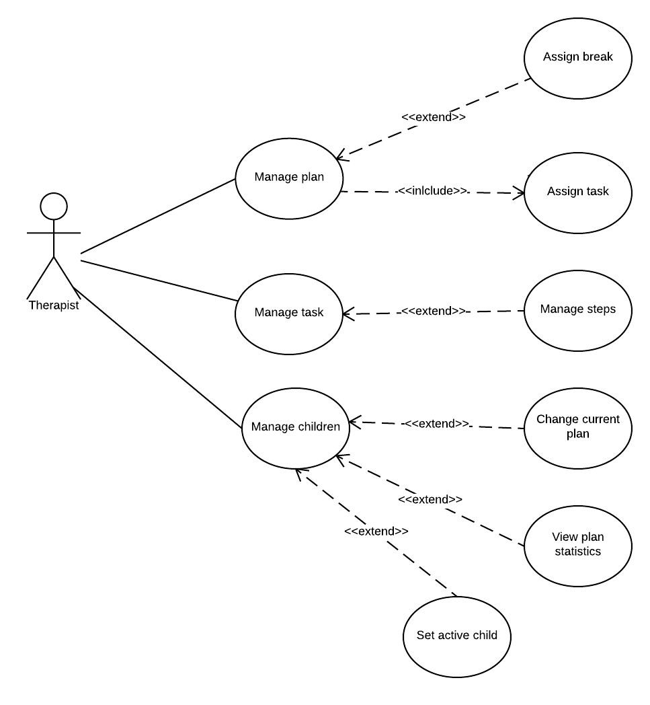
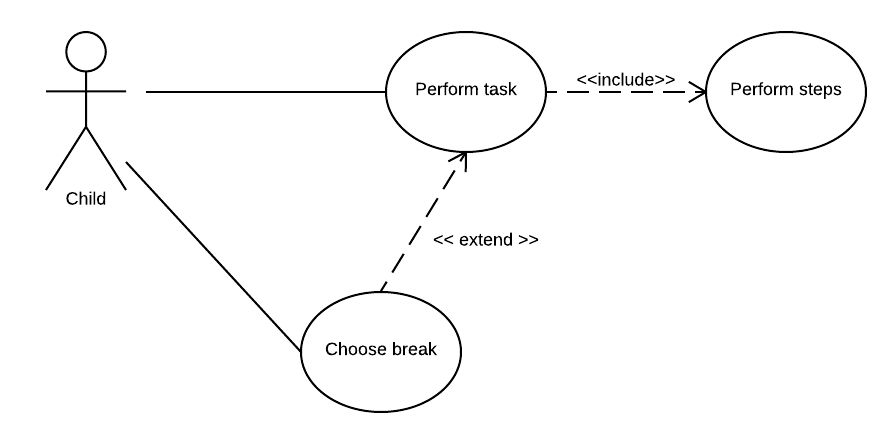

# Product requirements
## Stakeholders
- **Student** - Child at the age between 3 - 6, who experiences autism disorders. He or she is used to follow instructions from activity schedules prepared on purpose as a part of treatment. Every student has a different set of instructions depends on varied conditions e.g. age, level of disorder, previous experience or part of a treatment. Schedules are used in school and later in home.
- **Therapist** - Teacher, who takes care of student's treatment. He or she prepares activity schedules dedicated for each student. Every teacher can look after more then one student.
- **Parent**- Person, who works with the child at home with therapist's indications. He or she can use activity schedules prepared by teacher or on his/her own.

## Main functionalities

### Therapist use case diagram

- As therapist I need to create a plan containg specified tasks for every of children to reach treatment goals.
- As therapist I want to create tasks that I could assign to many plans and to one plan many times because I use different combination of available tasks during treatment.
- As therapist I want to prepare a task that can have image or video, sound and/or text for children to better understand the issue.
- As therapist I teach children with varied level of skills, so I need to be able to set different parameters like size of fonts, size of picture, type of displaying tasks and steps globaly for each student.
- As therapist I would like to limit execution of some tasks and step by timer, because some of them shouldn't take to much time.
- As therapist I would like to switch between plans easly during its execution and remember where we have finished last time with a progress bar visible with plan on plans list, because children are working with many plans during one session.
- As therapist I need to give child a break. A break is a special type of task which is pleasant for a child and perceived by the child as a reward. The set of available breaks for plan should be configured by me, and randomly be chosen to display in limited set with size configured per plan.

### Child use case diagram

- As child I want to perform tasks visible on screen to practise exercises.
- As child I need my task to be described by image, sound, video and text for me to better understand what should I do.
- As child I want actual performed task to by highlight on tasks' list to remember what I am doing now. Actual being performed task could have green background and next tasks in queue could have white. All done tasks should be grey and crossed out. This should be applied to tasks and their steps.
- As child I need some tasks to be limited by time, and I want to be informed when the time is up because I don't want to spend to many time on one task.
- As child I would like to see when all my tasks are finished to feel the satisfaction of finished plan.
- As child I sometimes need new tasks to be performed step by step for easier learning.
- As child I need a break during plan execution when I could play games or rest.
