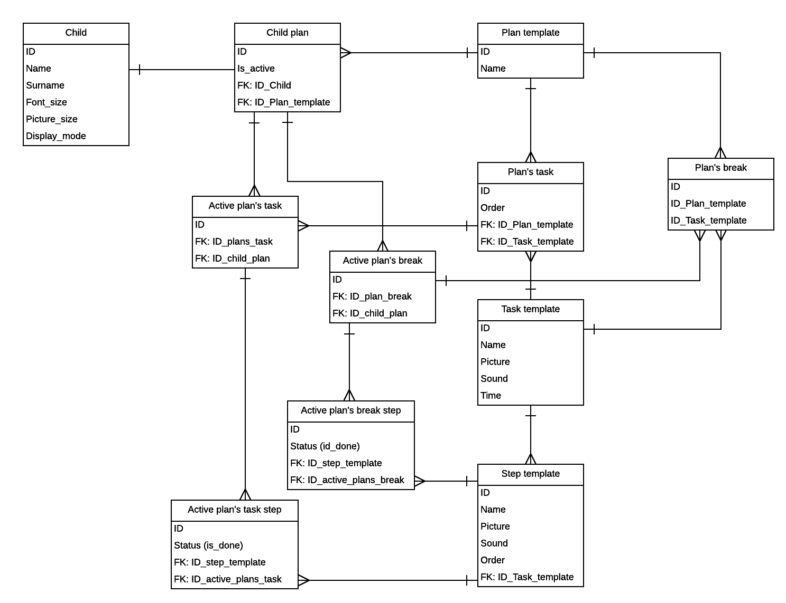

# Database
## Database diagram

## Description
There are plans' templates which can contain tasks' templates of two different destiny: plan task and break task. Each of tasks can be multiple assigned to one and many plans' templates.
Every task template also can have set of steps' templates assigned. The database storage also a set of children who have plans assigned for the purpose of execution. Every result of processed step should be saved, so every executed task, plan or break is reflected as record in active tables in database.
